# WhatsUp

WhatsUp is a WhatsApp clone built with Flutter and Firebase. It aims to replicate some of its core features
but its main purpose is to showcase how easy it is to build real-time applications with Flutter and Firebase.

## Features

- Phone Authentication 📲: Users can register their phone number and receive an OTP (One-Time Password) for verification.
- Light / Dark Theme 🌞🌚: You can switch between light and dark theme after you registered.
- Contacts Display 📒: Users can see their contacts who are already using the app.
- Real-time messaging 💬 ⚡: Clients can communicate each other in real time.
- Chat features 💬📷🎙️: Clients can send and receive text , images, videos and voice messages.
- Online / Offline Status 🟢🔴: Clients can see other users online or offline status.
- Read / Unread Messages ☑️👀: Clients can see if other users have read their messages.
- Message Replies ↩️: You can reply to specific messages in a conversation, facilitating threaded discussions.
- Emoji Support 😉: Users can send emojis in their messages using a built-in emoji picker.
- Group Chat 👥: Users can create groups and select the members.
- Status / Stories 📷🪩: Users can post status updates and view the status of other users.
- Video calls 📹🤳: Users can make video calls to their contacts.
- Call History 📞: Users can see their call history, who they called and who called them.
- Real-time updates ⚡: All of the above features are updated in real-time as they happen, and synced across devices.

## Screenshots

Here are some screenshots of the app.

|                Splash Screen                 |                Phone Authentication                 |                 OTP Verification                  |
| :------------------------------------------: | :-------------------------------------------------: | :-----------------------------------------------: |
|  | 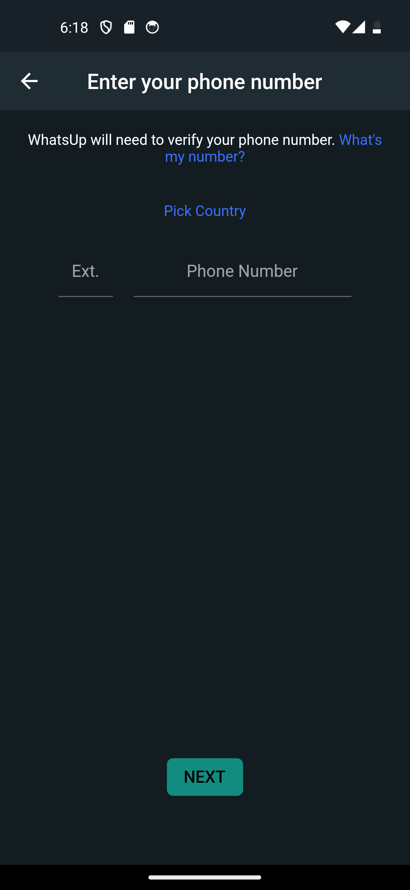 | 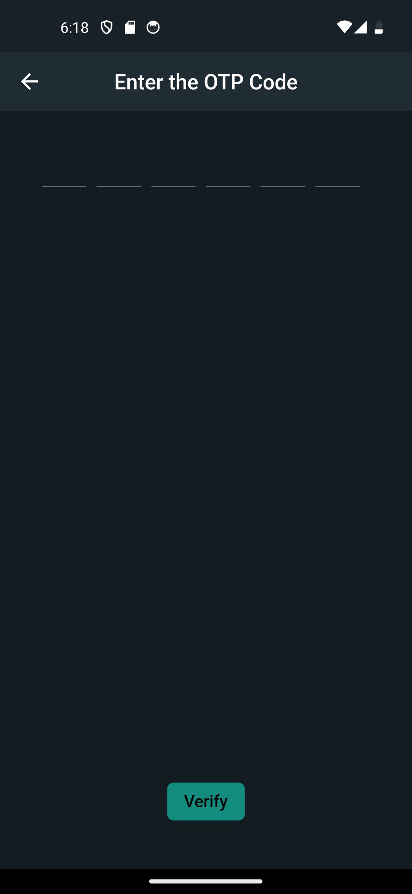 |

|                   Create Profile                    |               Chats               |              Chats Light Theme               |
| :-------------------------------------------------: | :-------------------------------: | :------------------------------------------: |
| 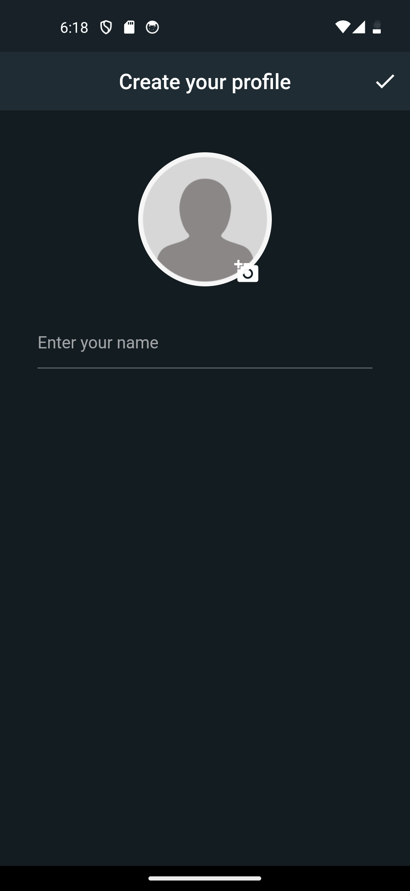 | 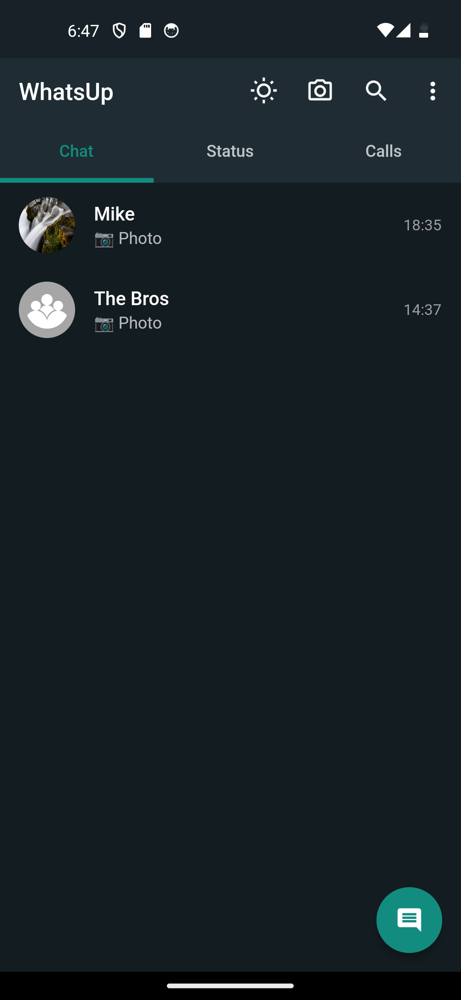 | 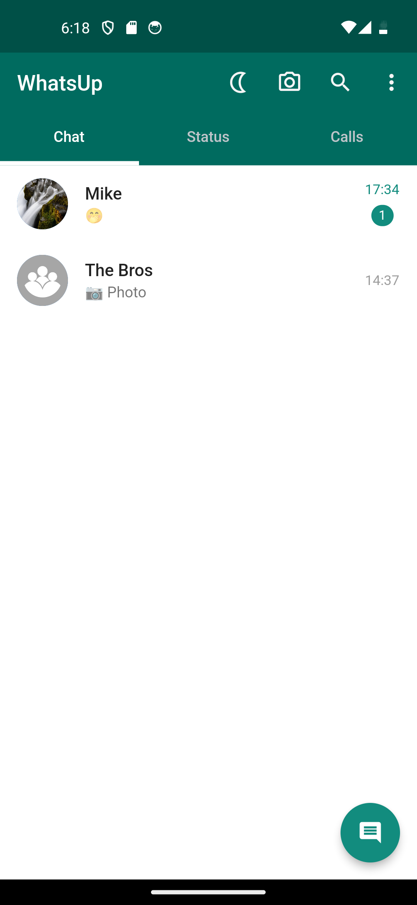 |

|              Chat               |                 Chat Reply                  |              Chat Light Theme               |
| :-----------------------------: | :-----------------------------------------: | :-----------------------------------------: |
| 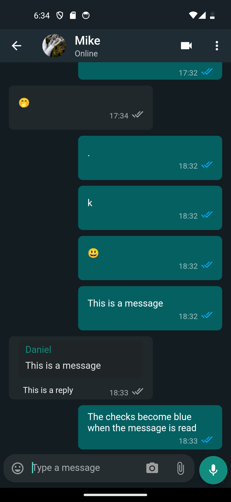 | 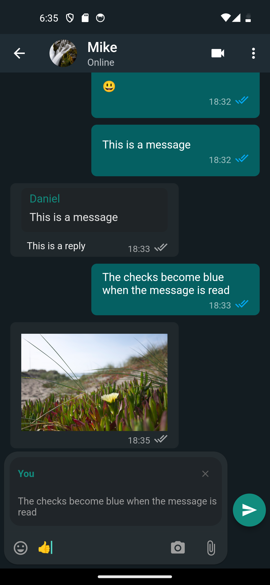 | 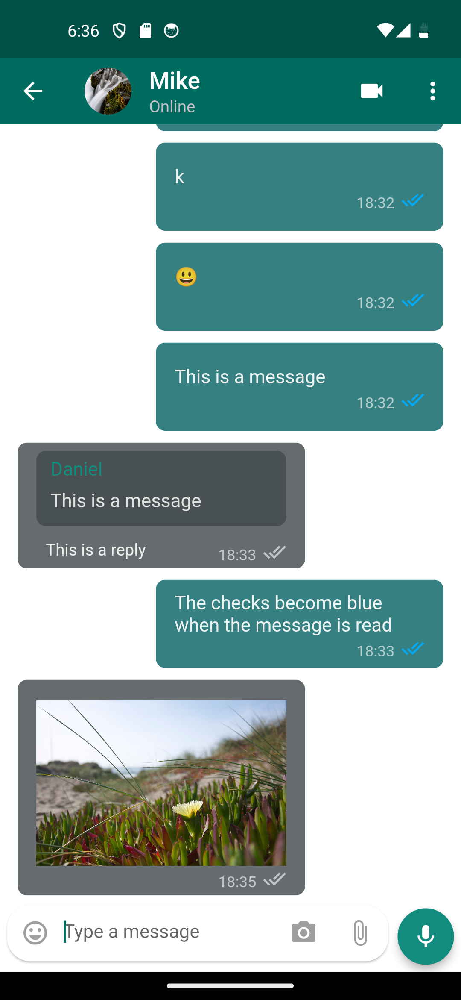 |

|                  Create Group                   |                     Create Group Light                      |                  Status Page                   |
| :---------------------------------------------: | :---------------------------------------------------------: | :--------------------------------------------: |
| 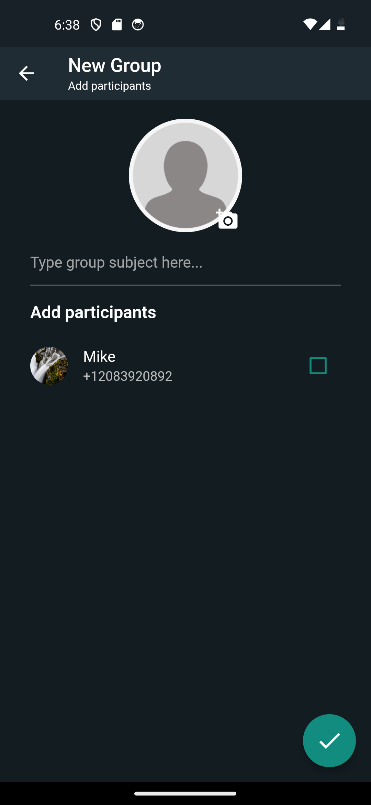 | 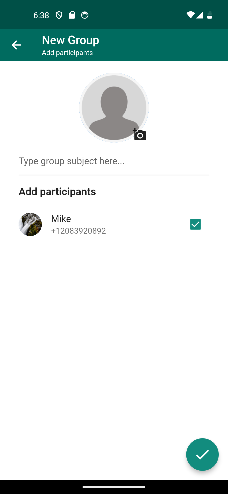 | 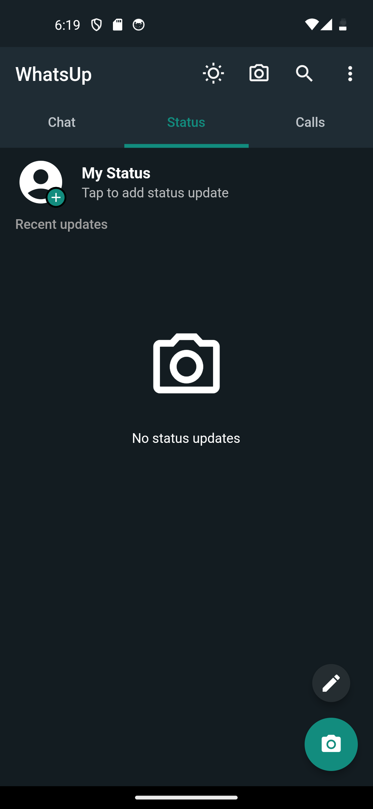 |

|                   Status Writer                   |                   Status Viewer                   |                        Status Updates                        |
| :-----------------------------------------------: | :-----------------------------------------------: | :----------------------------------------------------------: |
| 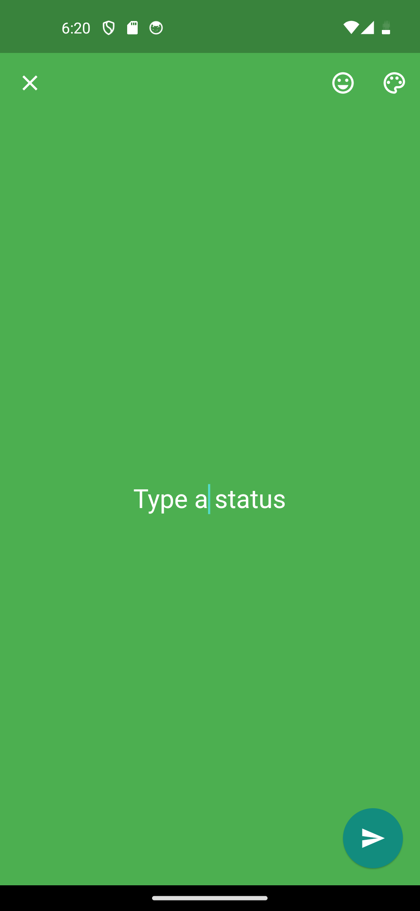 | 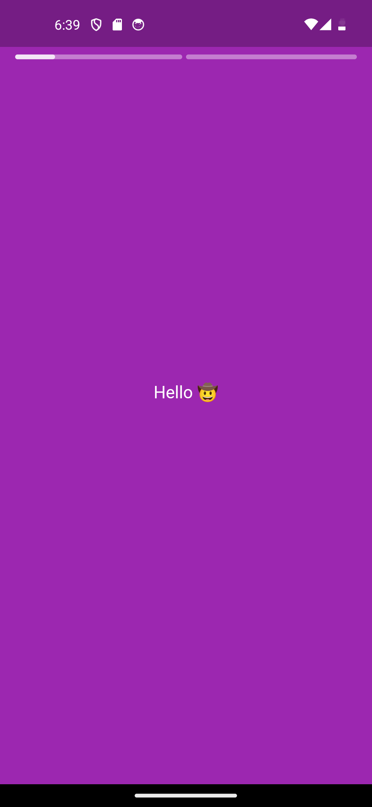 | 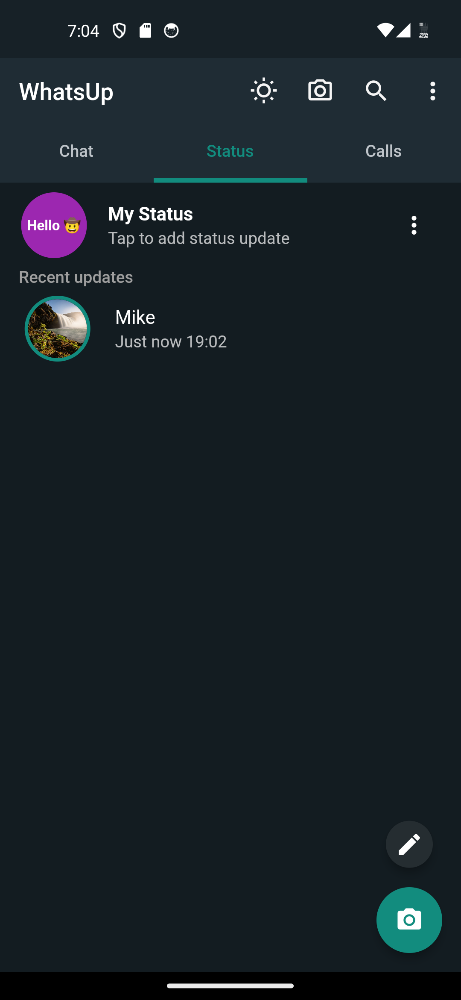 |

|                  Recent Calls                   |                     Recent Calls Light                      |                   Receiving Calls                    |
| :---------------------------------------------: | :---------------------------------------------------------: | :--------------------------------------------------: |
| 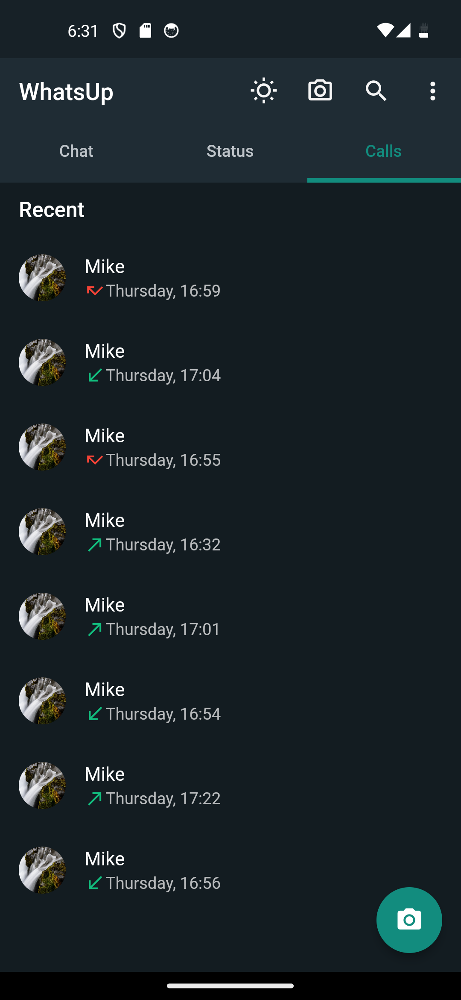 | 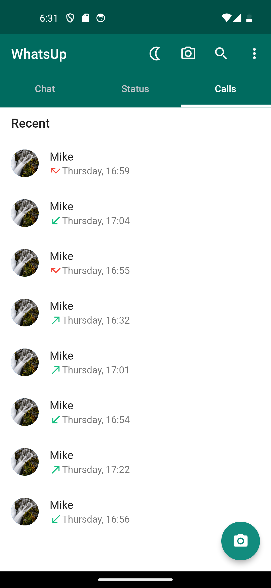 | 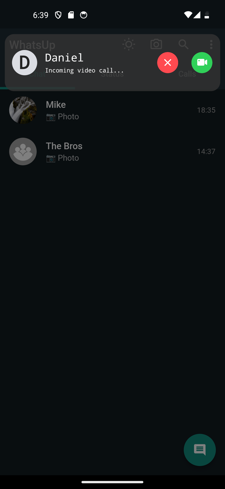 |
